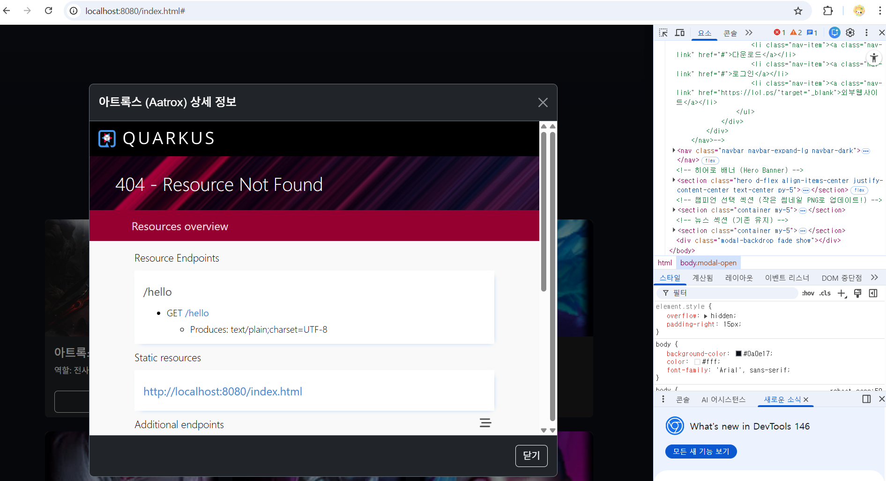
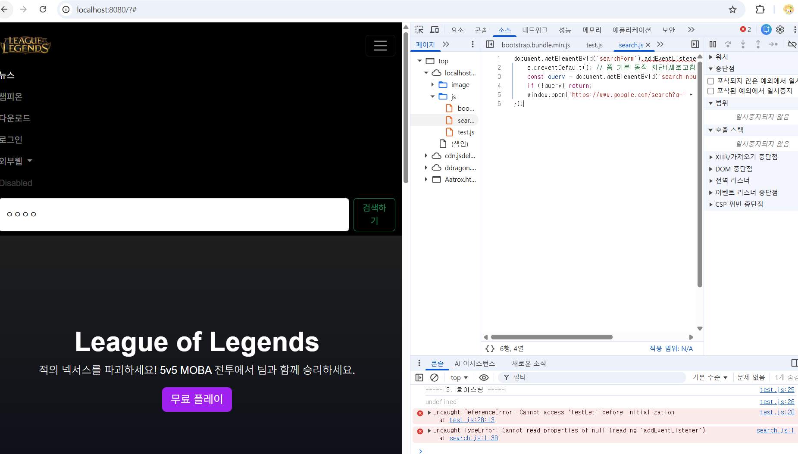

# quarkus 프로젝트 시작! (학번 : 20250627 이름 : 이예린 )
매 주 수업 내용을 정리하자.

## 2, 3주차 수업 내용
실습 1 : 쿼크스 환경 구축 및 준비 완료!
 
실습 2 : HTML 기본 및 LOL 메인 화면 개발 완료!

 

## 4주차 수업 내용
 
파일 생성
 
다운로드 페이지 수정
 

## 5주차 수업 내용
 
무료 플레이 수정
 
js폴더 추가

 
서치->구글 연동
 

## 6주차 수업 내용
 
검색 페이지 수정
 
